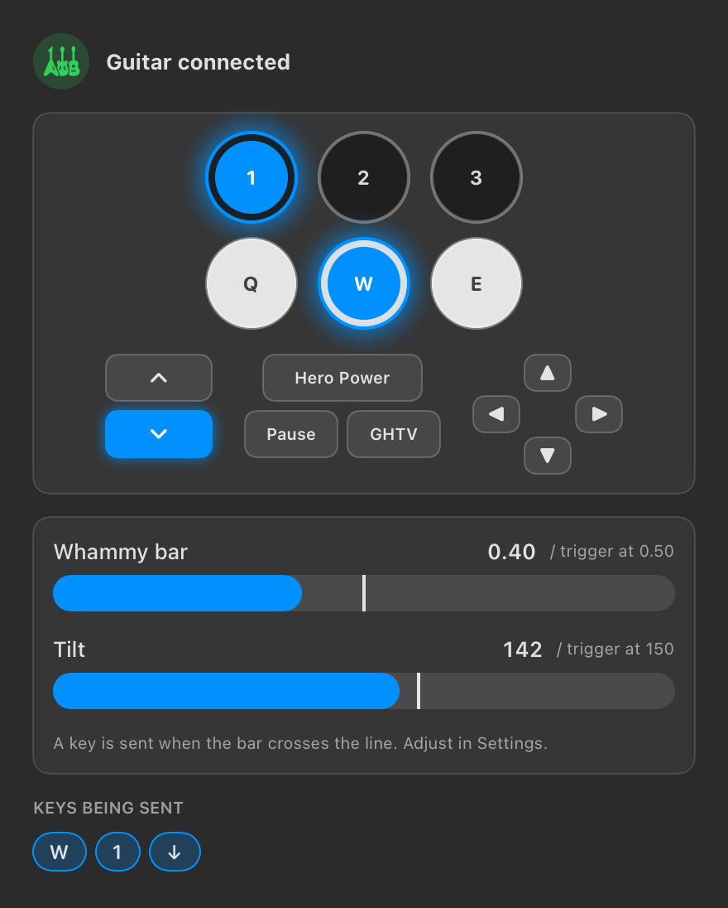
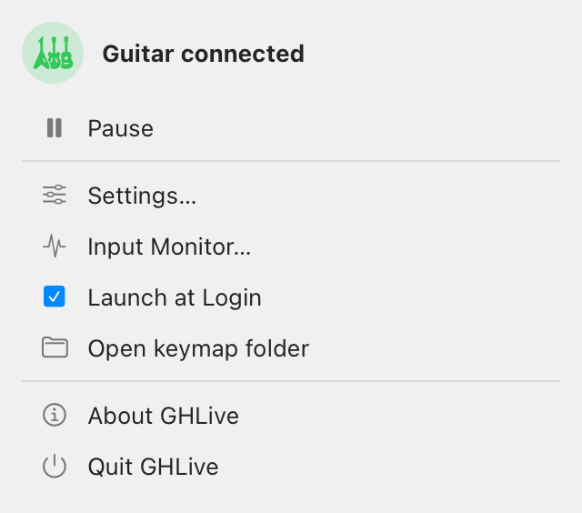
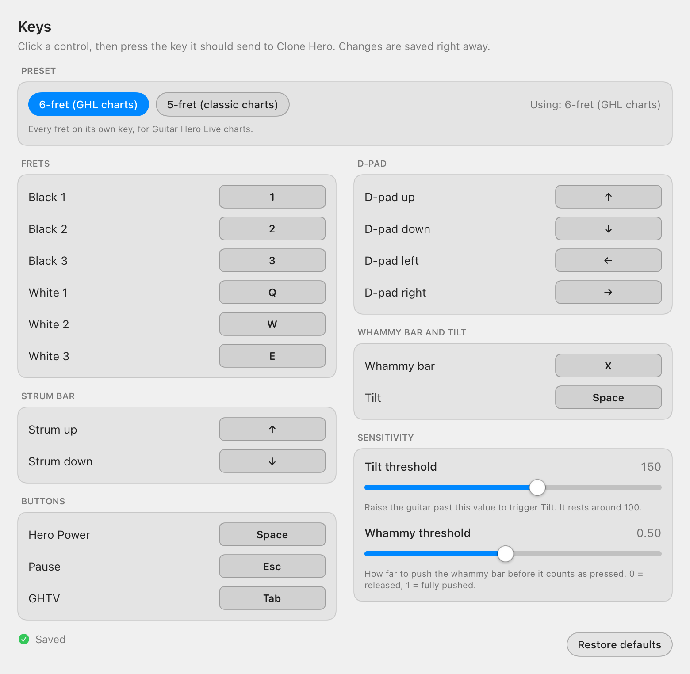

# GHLive Xbox One for Mac

Play **Guitar Hero Live on macOS**: use the GHL guitar with its Xbox One USB dongle in Clone Hero, YARG and other games that take keyboard input.

[](https://github.com/rodmarzavala/ghlive-xbox-one-mac/actions/workflows/ci.yml)
[](https://github.com/rodmarzavala/ghlive-xbox-one-mac/releases)
[](LICENSE)


macOS ships no driver for this dongle: it stays unconfigured and its LED never turns on. GHLive is a small menu-bar app that talks to the dongle directly over USB, reads the guitar, and turns every fret, strum and button into a key press. No kernel extensions, no SIP changes.

## Screenshots

<!-- TODO: add a short demo GIF (docs/images/demo.gif) showing the guitar driving the Input Monitor. -->

| Input Monitor | Menu bar |
|---|---|
|  |  |



## Features

- Menu-bar app, no Dock icon. Launch at Login is optional.
- Automatic reconnection: plug or unplug the dongle at any time.
- Settings window: click a control, press a key, done. Changes save automatically, and there is a "Restore defaults" button.
- Input Monitor: live frets, strum, buttons, d-pad, whammy and tilt meters with their thresholds, plus the keys currently being sent.
- Adjustable tilt and whammy thresholds.
- Pause and Resume from the menu.
- A command-line tool, `ghlive`, for diagnostics and headless use.
- Sends only keyboard events. No network access, no data collection.

## Requirements

- macOS 13 (Ventura) or newer, Apple Silicon or Intel (the app is universal).
- A Guitar Hero Live guitar and its **Xbox One** wireless dongle (USB ID `1430:079B`).
- A game that lets you bind keyboard keys to guitar controls (Clone Hero and YARG do).

## Install

1. Download `GHLive-<version>-macos-universal.zip` from the [latest release](https://github.com/rodmarzavala/ghlive-xbox-one-mac/releases) and unzip it.
2. Move `GHLive.app` to your `Applications` folder.
3. **First launch.** GHLive is ad-hoc signed but not notarized by Apple (see [why](#why-is-the-app-unsigned)), so macOS blocks it the first time. Open it once and dismiss the warning, then pick one of these:
   - **System Settings** -> **Privacy & Security**, scroll down to the message about GHLive and click **Open Anyway**. (Right-click -> Open no longer works on recent macOS versions.)
   - Or in Terminal: `xattr -dr com.apple.quarantine /Applications/GHLive.app`, then open the app again.
4. A guitar icon appears in the menu bar. Click it: until permission is granted, the menu shows a card, "Allow GHLive to press keys", with a **Grant Accessibility access...** button. Click it; macOS asks for permission and opens System Settings, where you switch GHLive on. This is required to send key presses.
5. Plug in the dongle. The status line goes from "Waiting for the dongle" to "Connecting to the dongle" and then "Dongle ready, turn on your guitar", and the dongle LED lights up.
6. Turn on the guitar. The status changes to "Guitar connected". If it does not connect, turn the guitar off and on again.

Want to check what you downloaded first? See [Verify your download](#verify-your-download). More install detail: [docs/install.md](docs/install.md).

### The menu

Status line, Pause / Resume, Settings..., Input Monitor..., Launch at Login, Open keymap folder, About GHLive, Quit GHLive.

**Launch at Login:** macOS may need your approval the first time. The menu then shows "Approve GHLive in System Settings > Login Items" with an **Open Login Items...** button; switch GHLive on there.

Your keymap is stored in `~/Library/Application Support/GHLive/keymap.json`.

### Default keys

| Guitar control | Key |
|---|---|
| Black 1 / 2 / 3 (top frets) | `1` / `2` / `3` |
| White 1 / 2 / 3 (bottom frets) | `Q` / `W` / `E` |
| Strum up / down | Up arrow / Down arrow |
| Hero Power | Space |
| Tilt | Space |
| Whammy bar | `X` |
| Pause | Esc |
| GHTV | Tab |
| D-pad | Arrow keys |

In Settings (controls are grouped under Frets, Strum bar, Buttons, D-pad, and Whammy bar and tilt), click a control, then press the key you want. Supported keys: A-Z, 0-9, the arrow keys, Space, Tab, Return, Escape and F1-F12.

## Set up Clone Hero

GHLive makes the guitar look like a keyboard, so the game needs to know which key is which control. Clone Hero supports 6-fret (GHL) guitars, and its controls can be bound to keys. In the game's controller settings, bind each guitar control to the key GHLive sends for it, using the table above (or your own keys from GHLive's Settings). Keep the game as the active window while you play: macOS delivers key presses to the app in front.

[YARG](https://yarg.in/) works the same way, since it accepts keyboard input: bind the keys in its own controller settings.

The exact menu names differ between game versions, so this guide does not spell them out. The Input Monitor helps here: it shows which key each control is sending right now.

## Calibrating tilt and whammy

Keyboard keys are on or off, so the whammy bar and tilt become switches that trigger once they pass a threshold.

1. Open **Input Monitor...** from the menu. It shows live frets, strum, buttons, d-pad, whammy and tilt meters, each with its threshold, and the keys being sent.
2. Move the whammy bar and raise the guitar. The meters show the live value next to "trigger at ...".
3. Open **Settings...** and adjust:
   - **Tilt threshold**, 1 to 255 (default 150). The guitar resting flat reads around 95 to 115, so set the threshold above that and below the value you reach when you raise the neck.
   - **Whammy threshold**, 0.05 to 1.0 (default 0.5): how far to push the bar before it counts as pressed.
4. Watch the keys being sent in the Input Monitor to confirm.

## Verify your download

Each release has two artifacts, each with a `.sha256` file:

- `GHLive-<version>-macos-universal.zip` (the app)
- `ghlive-<version>-macos-universal.tar.gz` (the command-line tool)

They are built by GitHub Actions from the tagged source and carry build provenance attestations. From the folder with the downloads:

```sh
shasum -a 256 -c GHLive-<version>-macos-universal.zip.sha256
gh attestation verify GHLive-<version>-macos-universal.zip --repo rodmarzavala/ghlive-xbox-one-mac
```

The first command checks the file was not corrupted or swapped. The second (needs the [GitHub CLI](https://cli.github.com/)) proves the file was produced by this repository's release workflow. Do the same for the `.tar.gz`.

## Build from source

You need Xcode or the Command Line Tools (`xcode-select --install`), and Swift 6.

```sh
make build      # swift build
make test       # swift test; works with only the Command Line Tools thanks to a Swift Testing plugin-path workaround
make lint       # swift format lint --strict
make release    # universal (arm64 + x86_64) release build
make app        # same as scripts/build-app.sh: GHLive.app and the CLI in dist/, like CI
```

Other useful commands:

```sh
swift scripts/make-icon.swift Resources/AppIcon.icns   # regenerate the app icon
GHLIVE_DRY_RUN=1 swift run GHLiveApp                    # GUI that posts no keys
swift run GHLiveApp --export-screenshots <dir>          # render the UI states to PNG files
GHLIVE_DRY_RUN=1 swift run GHLiveApp --open-window settings   # also: monitor; opens that window at launch
```

You are encouraged to compare the contents of your locally built zip with the release. The binaries will not be bit-identical, but you can compare the file list and `Info.plist`.

### The `ghlive` command

```text
ghlive run [--dry-run] [--verbose] [--keymap PATH]   wait for the dongle and send key presses
ghlive sniff                                          print the raw GIP packets (for bug reports)
ghlive keymap --print-default                         print the default keymap as JSON
ghlive --version
```

`--dry-run` prints `key down` / `key up` lines instead of posting keys and needs no Accessibility permission. Without it, your terminal needs Accessibility access. Errors are always printed to stderr as `error: <message> (retrying)`, with or without `--verbose`.

## Troubleshooting

Short version. Full guide: [docs/troubleshooting.md](docs/troubleshooting.md).

- **The dongle LED does not turn on.** Check the status line in the menu. If it says the dongle is in use by another app, see below. Otherwise unplug and replug it.
- **The guitar does not sync.** Switch the guitar on once the status reads "Dongle ready".
- **"The dongle is in use by another app".** Quit Steam, or any other app that reads Xbox controllers. GHLive retries every few seconds.
- **Keys do not reach the game.** Click "Grant Accessibility access..." in the menu and keep the game window focused.
- **It stopped working after an update.** Remove GHLive from the Accessibility list and add it again.
- **Intel Macs.** The build is universal and includes an Intel slice, but it has not been tested on an Intel Mac. Please report what you find.

## FAQ

**Is it safe?** The app only posts keyboard events. It has no network access and collects no data, and the source is right here to read. You can [verify](#verify-your-download) that your download was built from this repository.

### Why is the app unsigned?

Apple notarization requires a paid Apple Developer account, and this is a free hobby project without one. So the app is only ad-hoc signed and macOS shows a warning on first launch. Checksums and build attestations are the substitute: they let you confirm the file came from this repository's GitHub Actions build.

**Does it need kexts or SIP changes?** No. It runs in user space.

**Does it work with YARG?** YARG accepts keyboard input, so bind the keys the same way as in Clone Hero. This has not been tested with YARG.

**Can whammy and tilt be analog?** Not in v1. See [Limitations](#limitations).

**What about my PS3, Wii U or PS4 dongle?** Those are standard HID devices that Clone Hero reads directly, so you do not need GHLive. The Xbox 360 dongle is out of scope.

## Limitations

- v1 outputs keyboard events only, so whammy and tilt are on/off, not analog.
- Only the Xbox One GHL dongle (`1430:079B`) is supported.
- A virtual gamepad (DriverKit) is a possible future addition; the architecture already has a seam for it.
- The app is not notarized, so macOS may ask for Accessibility access again after each update.

## How it works

GHLive finds the dongle by its USB ID, configures it, runs the GIP (Gaming Input Protocol) power-on handshake, keeps it streaming with a periodic keep-alive, decodes the guitar's reports and posts matching keyboard events. Details: [docs/architecture.md](docs/architecture.md) and [docs/protocol-notes.md](docs/protocol-notes.md).

The `tools/` folder holds the Python prototype used to reverse-engineer the dongle (discovery, handshake, play). It is kept as a diagnostic; see [tools/README.md](tools/README.md).

## Contributing

Bug reports, packet logs and pull requests are welcome. Read [CONTRIBUTING.md](CONTRIBUTING.md) first. Security issues: [SECURITY.md](SECURITY.md). Changes per release: [CHANGELOG.md](CHANGELOG.md).

## Credits

- [PlasticBand](https://github.com/TheNathannator/PlasticBand) by TheNathannator, community documentation of rhythm game peripherals (CC BY-SA).
- [RB4InstrumentMapper](https://github.com/TheNathannator/RB4InstrumentMapper), the Windows mapper that supports this guitar.
- [MS-GIPUSB](https://learn.microsoft.com/en-us/openspecs/windows_protocols/ms-gipusb/e7c90904-5e21-426e-b9ad-d82adeee0dbc), Microsoft's open specification of GIP over USB.
- [xpad](https://github.com/paroj/xpad), the Linux driver, consulted only for protocol facts; no GPL code is used here.

## License

[MIT](LICENSE).

GHLive is an independent project. It is not affiliated with, endorsed by or sponsored by Activision, Microsoft or Clone Hero. "Guitar Hero", "Xbox" and "Clone Hero" belong to their respective owners.
